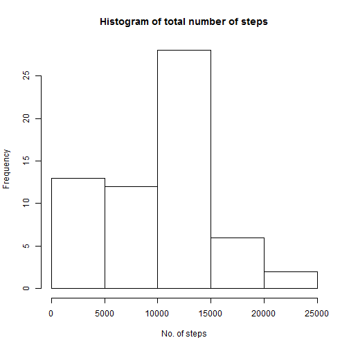
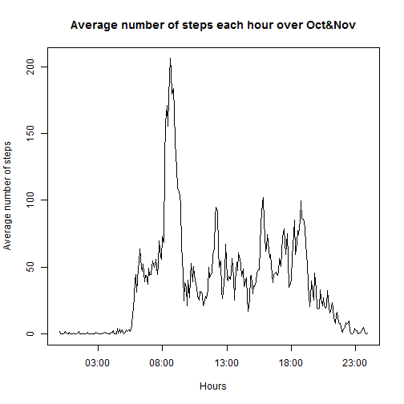
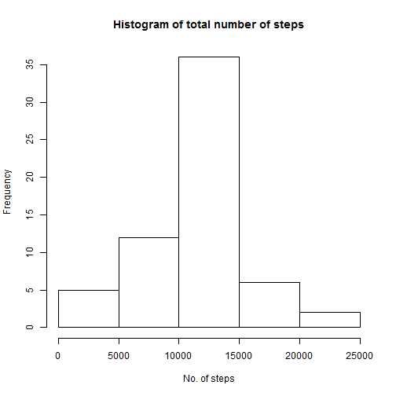
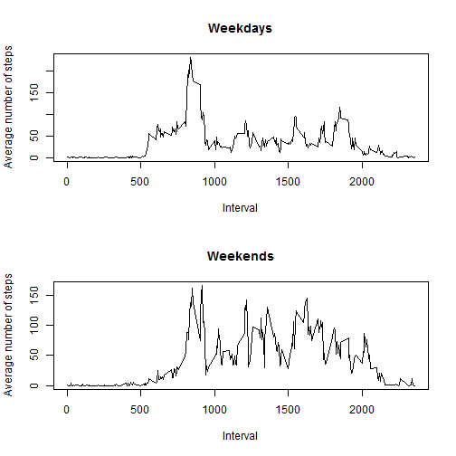

## Loading and preprocessing the data
1.First we load the data from activity.csv file to a data frame.

```r
activity_data<-read.csv("activity.csv")
```

## What is mean total number of steps taken per day?
To answer this question, 
3.We calculate total number of steps per day.

```r
sum_of_steps<-tapply(activity_data$steps,activity_data$date,sum,na.rm=1)
sum_of_steps
```

```
## 2012-10-01 2012-10-02 2012-10-03 2012-10-04 2012-10-05 2012-10-06 
##          0        126      11352      12116      13294      15420 
## 2012-10-07 2012-10-08 2012-10-09 2012-10-10 2012-10-11 2012-10-12 
##      11015          0      12811       9900      10304      17382 
## 2012-10-13 2012-10-14 2012-10-15 2012-10-16 2012-10-17 2012-10-18 
##      12426      15098      10139      15084      13452      10056 
## 2012-10-19 2012-10-20 2012-10-21 2012-10-22 2012-10-23 2012-10-24 
##      11829      10395       8821      13460       8918       8355 
## 2012-10-25 2012-10-26 2012-10-27 2012-10-28 2012-10-29 2012-10-30 
##       2492       6778      10119      11458       5018       9819 
## 2012-10-31 2012-11-01 2012-11-02 2012-11-03 2012-11-04 2012-11-05 
##      15414          0      10600      10571          0      10439 
## 2012-11-06 2012-11-07 2012-11-08 2012-11-09 2012-11-10 2012-11-11 
##       8334      12883       3219          0          0      12608 
## 2012-11-12 2012-11-13 2012-11-14 2012-11-15 2012-11-16 2012-11-17 
##      10765       7336          0         41       5441      14339 
## 2012-11-18 2012-11-19 2012-11-20 2012-11-21 2012-11-22 2012-11-23 
##      15110       8841       4472      12787      20427      21194 
## 2012-11-24 2012-11-25 2012-11-26 2012-11-27 2012-11-28 2012-11-29 
##      14478      11834      11162      13646      10183       7047 
## 2012-11-30 
##          0
```
4.Make a histogram of the total number of steps taken each day

```r
hist(sum_of_steps,main="Histogram of total number of steps",xlab="No. of steps")
```

 

5.Calculate and report the mean and median of the total number of steps taken per day

```r
mean(sum_of_steps)
```

```
## [1] 9354.23
```

```r
median(sum_of_steps)
```

```
## [1] 10395
```
## What is the average daily activity pattern?
To answer this question,we do the following.
6. Make a time series plot (i.e. type = "l") of the 5-minute interval (x-axis) and the average number of steps taken, averaged across all days (y-axis)

```r
activity_data$interval<-as.factor(activity_data$interval)
mean_steps_per_interval<-tapply(activity_data$steps,activity_data$interval,mean,na.rm=TRUE)
intervals<- strptime(sprintf("%04d", as.numeric(names(mean_steps_per_interval))), format="%H%M")
plot(intervals,mean_steps_per_interval,type='l',main="Average number of steps each hour over Oct&Nov",xlab="Hours",ylab="Average number of steps")
```

 

7.Which 5-minute interval, on average across all the days in the dataset, contains the maximum number of steps?

```r
index<-which.max(mean_steps_per_interval)
names(index)
```

```
## [1] "835"
```

## Imputing missing values
8.Calculate and report the total number of missing values in the dataset (i.e. the total number of rows with NAs)


```r
rows_with_missing_data<-activity_data[!complete.cases(activity_data),]
nrow(rows_with_missing_data)
```

```
## [1] 2304
```

9.Devise a strategy for filling in all of the missing values in the dataset. The strategy does not need to be sophisticated. For example, you could use the mean/median for that day, or the mean for that 5-minute interval, etc.
The strategy followed here is to complete NA values in steps variable with mean of the steps taken during that interval across all days.

```r
mean_steps_per_interval<-round(mean_steps_per_interval)
```
10.Create a new dataset that is equal to the original dataset but with the missing data filled in.

```r
new_activity_data<-activity_data
for (i in 1:length(new_activity_data$steps)) {
 if (is.na(new_activity_data$steps[i])) {
  new_activity_data$steps[i]<-mean_steps_per_interval[[new_activity_data[i,3]]]
	}
}
```
11. Make a histogram of the total number of steps taken each day and Calculate and report the mean and median total number of steps taken per day. Do these values differ from the estimates from the first part of the assignment? What is the impact of imputing missing data on the estimates of the total daily number of steps?

Histogram of the total number of steps taken each day.

```r
imputed_sum_of_steps<-tapply(new_activity_data$steps,new_activity_data$date,sum,na.rm=1)
imputed_sum_of_steps
```

```
## 2012-10-01 2012-10-02 2012-10-03 2012-10-04 2012-10-05 2012-10-06 
##      10762        126      11352      12116      13294      15420 
## 2012-10-07 2012-10-08 2012-10-09 2012-10-10 2012-10-11 2012-10-12 
##      11015      10762      12811       9900      10304      17382 
## 2012-10-13 2012-10-14 2012-10-15 2012-10-16 2012-10-17 2012-10-18 
##      12426      15098      10139      15084      13452      10056 
## 2012-10-19 2012-10-20 2012-10-21 2012-10-22 2012-10-23 2012-10-24 
##      11829      10395       8821      13460       8918       8355 
## 2012-10-25 2012-10-26 2012-10-27 2012-10-28 2012-10-29 2012-10-30 
##       2492       6778      10119      11458       5018       9819 
## 2012-10-31 2012-11-01 2012-11-02 2012-11-03 2012-11-04 2012-11-05 
##      15414      10762      10600      10571      10762      10439 
## 2012-11-06 2012-11-07 2012-11-08 2012-11-09 2012-11-10 2012-11-11 
##       8334      12883       3219      10762      10762      12608 
## 2012-11-12 2012-11-13 2012-11-14 2012-11-15 2012-11-16 2012-11-17 
##      10765       7336      10762         41       5441      14339 
## 2012-11-18 2012-11-19 2012-11-20 2012-11-21 2012-11-22 2012-11-23 
##      15110       8841       4472      12787      20427      21194 
## 2012-11-24 2012-11-25 2012-11-26 2012-11-27 2012-11-28 2012-11-29 
##      14478      11834      11162      13646      10183       7047 
## 2012-11-30 
##      10762
```

```r
hist(imputed_sum_of_steps,main="Histogram of total number of steps",xlab="No. of steps")
```

 

Mean of the total number of steps taken each day

```r
mean(imputed_sum_of_steps)
```

```
## [1] 10765.64
```
Median of the total number of steps taken each day

```r
median(imputed_sum_of_steps)
```

```
## [1] 10762
```
12.Create a new factor variable in the dataset with two levels - "weekday" and "weekend" indicating whether a given date is a weekday or weekend day.

```r
new_activity_data$date<-as.Date(new_activity_data$date,format="%Y-%m-%d")
new_activity_data$days<-weekdays(new_activity_data$date)
new_activity_data$wend <- as.factor(ifelse(new_activity_data$days %in% c("Saturday","Sunday"), "Weekend", "Weekday"))
```
13.Make a panel plot containing a time series plot (i.e. type = "l") of the 5-minute interval (x-axis) and the average number of steps taken, averaged across all weekday days or weekend days (y-axis). See the README file in the GitHub repository to see an example of what this plot should look like using simulated data.

Divide the data into two seperate data sets(one for weekdays/one for weekends)


```r
weekday_activity<-subset(new_activity_data,wend=="Weekday")
weekday_mean_steps_per_interval<-tapply(weekday_activity$steps,weekday_activity$interval,mean,na.rm=TRUE)
weekend_activity<-subset(new_activity_data,wend=="Weekend")
weekend_mean_steps_per_interval<-tapply(weekend_activity$steps,weekend_activity$interval,mean,na.rm=TRUE)
```

Plot the graphs in different panels

```r
par(mfrow=c(2,1))
plot(names(weekday_mean_steps_per_interval),weekday_mean_steps_per_interval,type='l',main="Weekdays",xlab="Interval",ylab="Average number of steps")
plot(names(weekend_mean_steps_per_interval),weekend_mean_steps_per_interval,type='l',main="Weekends",xlab="Interval",ylab="Average number of steps")
```

 

## Are there differences in activity patterns between weekdays and weekends?

There are differences in activity patterns between weekdays and weekends. The subject is more active during weekends than on weekdays as seen from the graphs.

